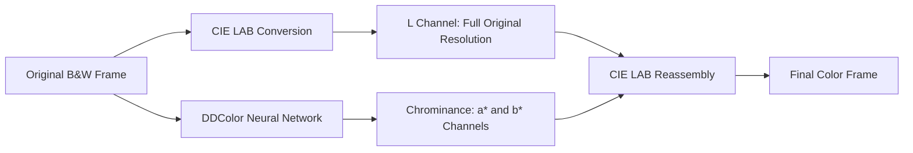

# 🛸 Video Colorizer

An industrial AI-assisted colorization pipeline for classic black-and-white audiovisual material (35mm/16mm film or analog video), designed specifically for the original **Lost in Space (1965–1968)** television series.

It provides **historically faithful color**, **full preservation of the original grain and sharpness**, **stable temporal color without color boiling**, and **zero LLM token usage** through fully local execution or cloud GPU acceleration.

## 🌟 Core Pipeline Principles



1. **Luminance ($L$) invariance in CIE LAB:**
   - Colorization networks normally reduce the image internally to 512×512 to resolve semantics. Using the network's reconstructed RGB output directly would damage film texture.
   - This pipeline retains the **$L$ channel at full native resolution** and uses the network only to predict $a^*$ and $b^*$.
   - **Result:** no loss of original definition, sharpness, or microcontrast.

2. **Shot boundary detection:**
   - Each episode is analyzed for camera cuts before processing. Color is never interpolated across a hard cut.

3. **Shot-based chrominance propagation and stabilization:**
   - Bidirectional dense DIS optical flow with photometric confidence aligns color keyframes. A robust statistical transfer stabilizes only `a*` and `b*` against the shot anchor. State resets at each cut and persists when a long shot is divided into bounded memory windows. The original `L` channel never enters the stabilizer. See [`temporal_chroma.py`](temporal_chroma.py).

4. **Piped FFmpeg streaming:**
   - Frames stream directly from memory to FFmpeg (`rawvideo -> libx264`) instead of being stored as loose image files.
   - Checkpoints are written in 500-frame blocks with automatic resume. Original audio tracks, metadata, and chapters are remuxed without audio re-encoding.

## 🎨 Canonical Visual Reference Banks

The project includes native-resolution reference frames extracted from original color masters:

- **Season 2 ([`references/season2_canon/`](references/season2_canon/README.md)):** 9 vegetation references, 10 interior references, and 18 identified monsters and creatures. This is the closest production-era reference for Season 1.
- **Season 3 ([`references/season3_canon/`](references/season3_canon/README.md)):** silver flight uniforms, EVA suits, the Jupiter 2 exterior, space environments, planetary clothing, caves, vegetation, and recurring creatures.

The unified selection policy is documented in [`references/README.md`](references/README.md).

## 💻 Local Installation and Use (macOS / Apple Silicon)

### Automatic installation

```bash
chmod +x install.sh
./install.sh
```

The installer configures Homebrew dependencies, creates `.venv` with Metal/MPS support, and downloads DDColor weights into `models/`.

### Configure directories (optional)

```bash
cp .env.example .env.local
```

Edit `.env.local` to select custom input and output directories.

### Colorization commands

```bash
# Colorize Episode 1 with the default mode
./colorize.sh 1

# Colorize an episode range
./colorize.sh 1-5

# Process the complete season
./colorize.sh -all

# Recommended balanced mode
./colorize.sh 1 --mode balanced --sample-step 8

# Fast mode
./colorize.sh 1 --mode fast --sample-step 20

# Direct neural inference on every frame
./colorize.sh 1 --mode direct

# Reprocess an existing output
./colorize.sh 1 --force
```

## ☁️ Google Colab Execution (NVIDIA CUDA)

1. Open [Google Colab](https://colab.research.google.com/).
2. Upload or open [`lost_in_space_colab.ipynb`](lost_in_space_colab.ipynb).
3. Select a **T4 GPU** or better under `Runtime > Change runtime type`.
4. Connect Google Drive. Inputs default to `MyDrive/LostInSpace/Input`; outputs default to `MyDrive/LostInSpace/Colorized`.
5. Adjust the Colab form and start the colorization cell.

## 🎬 DaVinci Resolve Studio Finishing Workflow

For a period Technicolor/Eastmancolor 1966 finish:

1. Load `references/season2_canon/` frames as gallery stills and use a wipe to match saturation and warm shadows.
2. If a difficult shot retains small fluctuations, apply OpenFX Deflicker in *Fluorescent / Time-lapse* mode with a radius of one or two frames.
3. Export as Apple ProRes 422 HQ or H.264 High Profile while preserving synchronized audio.

## 📁 Project Structure

```text
├── colorize.sh                  # Main macOS command-line launcher
├── colorize_episode.py          # Core colorization engine
├── temporal_chroma.py           # Temporal propagation and optical flow
├── space_palette.py             # Canonical space palette rules
├── lost_in_space_colab.ipynb    # Google Colab notebook
├── install.sh                   # Automatic installer
├── Instalar.command             # Double-clickable macOS Finder installer
├── crear_paquete.sh             # Portable archive generator
├── DDColor/                     # Upstream DDColor implementation
├── scripts/                     # Canon builders and utilities
├── references/                  # Canonical visual reference banks
├── input/                       # Black-and-white source episodes
└── output/                      # Completed colorized episodes
```

### 🇪🇸 A Note on Spanish Filenames and Directories

> [!NOTE]
> We sincerely apologize to non-Spanish speakers: we were honestly too lazy to do a proper translation and refactor all legacy paths lol.
>
> While every user-facing console message, CLI argument, installer prompt, and progress label is fully translated into English, several filenames, legacy directory keys, and media tags remain in Spanish to avoid breaking backward compatibility with existing reference banks, manifests, and media libraries:
>
> | Name / Path | Type | Meaning & Purpose |
> |---|---|---|
> | `Instalar.command` | File | *"Install"* &mdash; double-clickable macOS Finder launcher that executes `install.sh`. |
> | `crear_paquete.sh` | File | *"Create package"* &mdash; automation script to build the portable community distribution zip. |
> | `references/season2_canon/interiores/` | Directory | *"Interiors"* &mdash; Season 2 reference frames for the Jupiter 2 cabin, flight deck, and alien interiors. |
> | `references/season2_canon/vegetacion/` | Directory | *"Vegetation"* &mdash; reference frames for alien foliage, trees, and swamp plants. |
> | `references/season2_canon/monstruos/` | Directory | *"Monsters / Creatures"* &mdash; reference frames for aliens, beasts, and guest creatures. |
> | `CONTACT_SHEET_*.jpg` | Files | Visual review grids named after the above categories (`INTERIORES`, `VEGETACION`, `MONSTRUOS`). |
> | `*.Colorized.latino.mp4` | File Suffix | *"Latino"* denotes that the output video retains the original Latin American Spanish audio track remuxed from the source MKV. |

## 📄 License

The project-specific pipeline code is licensed under the MIT License. DDColor architecture and weights use their respective Apache 2.0 license. *Lost in Space* audiovisual material and names belong to their respective rights holders.
