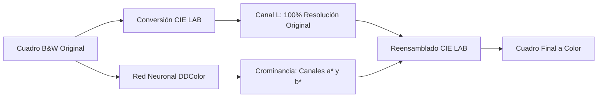

# 🛸 Video Colorizer — Lost in Space (1965)

Pipeline industrial de colorización asistida por IA para material audiovisual clásico en blanco y negro (película de 35mm/16mm o video analógico), diseñado específicamente para la serie clásica **Perdidos en el Espacio (*Lost in Space*, 1965–1968)**.

Garantiza **fidelidad histórica cromática**, **preservación total del grano/nitidez original**, **cero parpadeo temporal (*color boiling*)** y **cero consumo de tokens de LLM** mediante ejecución 100% local o acelerada por GPU en la nube.

---

## 🌟 Principios de Oro del Pipeline



1. **Invarianza de Luminancia ($L$) en CIE LAB:**
   - Las redes neuronales de colorización suelen reducir internamente la resolución a 512×512 para resolver la semántica. Si se usa el RGB reconstruido por la red, se destruye la textura fílmica.
   - Este pipeline convierte el fotograma a espacio **CIE LAB**, retiene el **canal $L$ al 100% de la resolución nativa** y utiliza la red exclusivamente para predecir los canales cromáticos $a^*$ y $b^*$.
   - **Resultado:** Cero pérdida de definición, nitidez o microcontraste original.

2. **Segmentación de Planos (*Shot Boundary Detection*):**
   - El episodio se analiza automáticamente para detectar cortes de cámara antes de procesar. Nunca se interpolan colores a través de un corte brusco, evitando aberraciones y contaminación cruzada.

3. **Propagación Temporal con Flujo Óptico (Anti-Flicker):**
   - Utiliza flujo óptico denso bidireccional (DIS Optical Flow) con control de confianza fotométrica ([`temporal_chroma.py`](file:///Users/jdmarinv/Dev/lost_in_space_colorize/temporal_chroma.py)) para alinear e interpolar keyframes de color, erradicando el molesto parpadeo o efervescencia cromática (*color boiling*).

4. **Streaming a FFmpeg por Tubería (*Zero-Disk Overhead*):**
   - No guarda decenas de gigabytes de imágenes sueltas en disco. Los fotogramas se transmiten directamente de RAM a stdin de FFmpeg (`rawvideo -> libx264`).
   - Sistema de checkpoints en bloques de 500 fotogramas con reanudación automática (*auto-resume*) y multiplexación de pistas de audio latino/inglés y capítulos originales sin recodificación.

---

## 🎨 Bancos Canónicos de Referencia Visual

El proyecto cuenta con bancos de fotogramas de referencia extraídos en resolución nativa desde los másteres originales en color:

- **Temporada 2 ([`references/season2_canon/`](file:///Users/jdmarinv/Dev/lost_in_space_colorize/references/season2_canon/)):**
  - **Vegetación (9 referencias):** Follaje de pantano (S02E04), matorrales desérticos (S02E08), flores carmesí (S02E15), arbustos verdes con flores amarillas (S02E16) y cultivos alienígenas (S02E25).
  - **Interiores (10 referencias):** Puente de vuelo y radar del Júpiter 2 (S02E01, S02E15), salón con sillones giratorios rojos (S02E28), laboratorio de sueños (S02E14), gran salón vikingo (S02E20) y engranajes anatómicos del Robot B-9 (S02E26).
  - **Monstruos y Criaturas (18 referencias):** Nerim de roca y lodo (S02E01), sirena Lorelei (S02E02), Tiabo (S02E04), Yeti cósmico (S02E05), Morbus (S02E12), Radion (S02E14), Keema el hombre dorado (S02E15), Gundar (S02E15), Athena la mujer verde (S02E16), dragón Questing Beast (S02E17), reina Brynhilda (S02E20), IDAK Alpha 12 (S02E24) y ejército de mini-robots (S02E28).
  - Incluye hojas de contacto visuales tituladas: `CONTACT_SHEET_VEGETACION.jpg`, `CONTACT_SHEET_INTERIORES.jpg` y `CONTACT_SHEET_MONSTRUOS.jpg`.

- **Temporada 3 ([`references/season3_canon/`](file:///Users/jdmarinv/Dev/lost_in_space_colorize/references/season3_canon/)):**
  - Trajes de vuelo plateados con ribete rojo, trajes EVA con torso rojo-anaranjado y cascos blancos, casco exterior plateado de la Júpiter 2 y nebulosas estelares cálidas.

---

## 💻 Instalación y Ejecución Local (macOS / Apple Silicon)

### 1. Instalación Automática
```bash
chmod +x install.sh
./install.sh
```
El instalador configura las dependencias vía Homebrew (`ffmpeg`), crea el entorno virtual `.venv` con aceleración GPU Metal (MPS) y descarga automáticamente los pesos de DDColor en `models/`.

### 2. Configurar Carpetas (Opcional)
Copia `.env.example` como `.env.local` si deseas usar rutas personalizadas para tus episodios:
```bash
cp .env.example .env.local
```

### 3. Comandos de Colorización ([`colorize.sh`](file:///Users/jdmarinv/Dev/lost_in_space_colorize/colorize.sh))
```bash
# Colorizar el Episodio 1 (modo balanceado por defecto)
./colorize.sh 1

# Colorizar un rango de episodios
./colorize.sh 1-5

# Procesar toda la temporada
./colorize.sh all

# Opciones avanzadas:
# Modo balanceado recomendado (keyframes cada 8 frames con flujo óptico):
./colorize.sh 1 --mode balanced --sample-step 8

# Modo rápido (keyframes cada 20 frames):
./colorize.sh 1 --mode fast --sample-step 20

# Modo directo (inferencia fotograma por fotograma, máxima precisión):
./colorize.sh 1 --mode direct

# Forzar reprocesamiento si el archivo ya existe:
./colorize.sh 1 --force
```

---

## ☁️ Ejecución en Google Colab (GPU NVIDIA CUDA)

Si prefieres no utilizar los recursos de tu ordenador o procesar a mayor velocidad en la nube:

1. Abre [Google Colab](https://colab.research.google.com/).
2. Sube o abre el cuaderno [`lost_in_space_colab.ipynb`](file:///Users/jdmarinv/Dev/lost_in_space_colorize/lost_in_space_colab.ipynb).
3. Selecciona un entorno con GPU (**T4 GPU** o superior) en `Entorno de ejecución > Cambiar tipo de entorno`.
4. Conecta tu Google Drive para leer los `.mkv` de entrada desde `MyDrive/LostInSpace/Input` y guardar los episodios finales en `MyDrive/LostInSpace/Colorized`.
5. Ajusta los parámetros en la interfaz visual de Colab Forms y lanza la colorización.

---

## 🎬 Flujo de Acabado en DaVinci Resolve Studio

Para lograr el acabado cinematográfico de época (*Technicolor / Eastmancolor 1966*):

1. **Color Match:** En la pestaña *Color*, usar los fotogramas de `references/season2_canon/` como *Stills* en la galería y aplicar *Wipe* para igualar saturación y sombras cálidas.
2. **Deflicker Temporal:** Si algún plano complejo presenta micro-fluctuaciones residuales, aplicar el plugin OpenFX *Deflicker* en modo *Fluorescent / Time-lapse* con un radio de 1 a 2 fotogramas.
3. **Mastering:** Exportar en Apple ProRes 422 HQ o H.264 High Profile conservando el audio sincronizado.

---

## 📁 Estructura del Proyecto

```text
├── colorize.sh                  # Lanzador principal CLI para macOS
├── colorize_episode.py          # Motor central de colorización (PyTorch + Metal/CUDA)
├── temporal_chroma.py           # Propagación temporal y flujo óptico DIS
├── space_palette.py             # Paleta canónica del espacio y nebulosas
├── lost_in_space_colab.ipynb    # Cuaderno interactivo para Google Colab (NVIDIA)
├── install.sh                   # Script de instalación automática
├── crear_paquete.sh             # Generador de paquete comprimido portable
├── DDColor/                     # Arquitectura de la red neuronal DDColor
├── scripts/
│   ├── build_season2_canon.py   # Extractor de referencias de la Temporada 2
│   └── build_season3_canon.py   # Extractor de referencias de la Temporada 3
├── references/
│   ├── season2_canon/           # Referencias visuales (vegetación, interiores, monstruos)
│   └── season3_canon/           # Referencias visuales (vestuarios, trajes EVA, espacio)
├── input/                       # Carpeta local para episodios en B&W
└── output/                      # Carpeta local para episodios colorizados
```

---

## 📄 Licencia

El código propio del pipeline está bajo licencia MIT. La arquitectura y pesos de DDColor se distribuyen bajo su respectiva licencia Apache 2.0. El material audiovisual y nombres de *Lost in Space* pertenecen a sus respectivos titulares de derechos.
